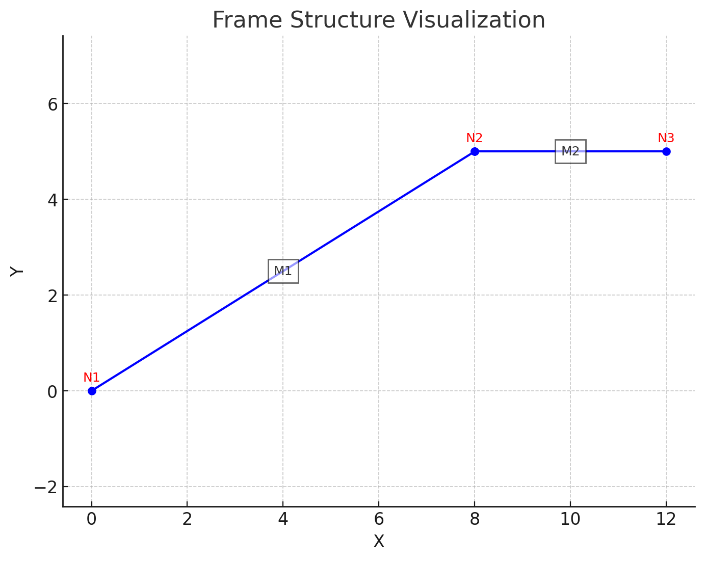

# CIL3060 Lab Project: Direct Stiffness Method

This repository contains a Python implementation of the **Direct Stiffness Method** for 2D structural frame analysis. It automates matrix assembly, load processing, and result computation for both vertical and inclined members using CSV input files.

## 👨‍💻 Author

- **Alok Godara** - b22ci004@iitj.ac.in

## 📁 Project Structure

- `ASA_Project_Final.ipynb`: Jupyter Notebook implementation with explanations and outputs.
- `asa_project_final.py`: Standalone Python script.
- `nodes.csv`: Input file containing node coordinates, support conditions, external forces, and settlements.
- `members.csv`: Input file containing member properties, connectivity, and loads.
- `ASA_Project_Report.pdf`: Original full report.
- `CIL3060_Lab_Report_Alok_Godara.pdf`: Summary report (also available in this repo).
- `CIL3060 Lab Project.pdf`: Lab assignment brief.

## 🧮 Features

- Supports **point loads**, **UDL**, **UVL**, and **trapezoidal loads**
- Handles **various support types**: fixed, pinned, rollers, and free
- Includes **support settlements**
- Calculates:
  - Displacements at unknown DOFs
  - Support reactions
  - Internal member forces
- Symbolic computation using `SymPy` and matrix operations using `NumPy`
- Output formatted using the `tabulate` library

## 🗂️ Inputs

### `nodes.csv`
| node_id | x | y | support_type | external_H | external_V | external_M | settlement_u | settlement_v | settlement_theta |
|---------|---|---|---------------|-------------|-------------|-------------|----------------|----------------|---------------------|

### `members.csv`
| member_id | node1 | node2 | A | E | I | loads |
|-----------|--------|--------|---|---|---|--------|
`loads` column supports strings like: `point_load;5000;2;3`, `uniform_distributed_load;2000;1;4`

## 🧠 Methodology

The analysis involves:
1. Importing data
2. Calculating lengths, angles
3. Assembling stiffness matrices
4. Computing global force-displacement equations
5. Solving using symbolic math (`SymPy`)

## 📐 Frame Used

## 📊 Comparison

The results have been cross-verified with **STAAD Pro** outputs for validation.

## ✅ Status

✔️ Fully functional  
🛠️ Suitable for academic use and further extension

## 📜 License

This project is intended for educational use under the terms of your academic institution.
